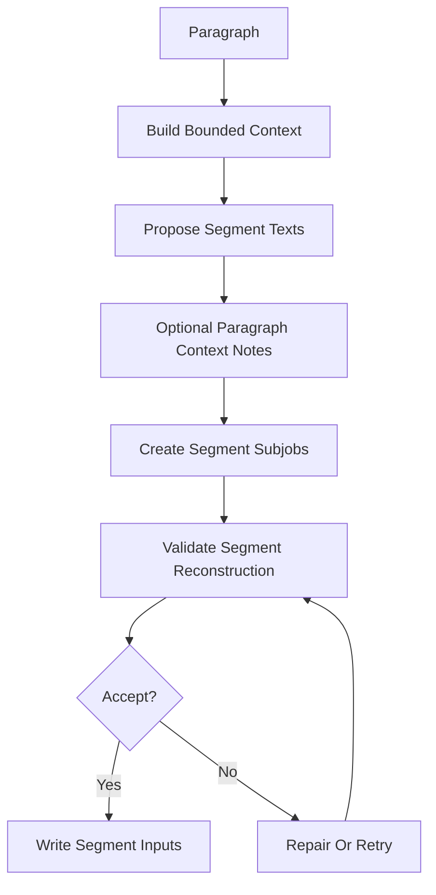
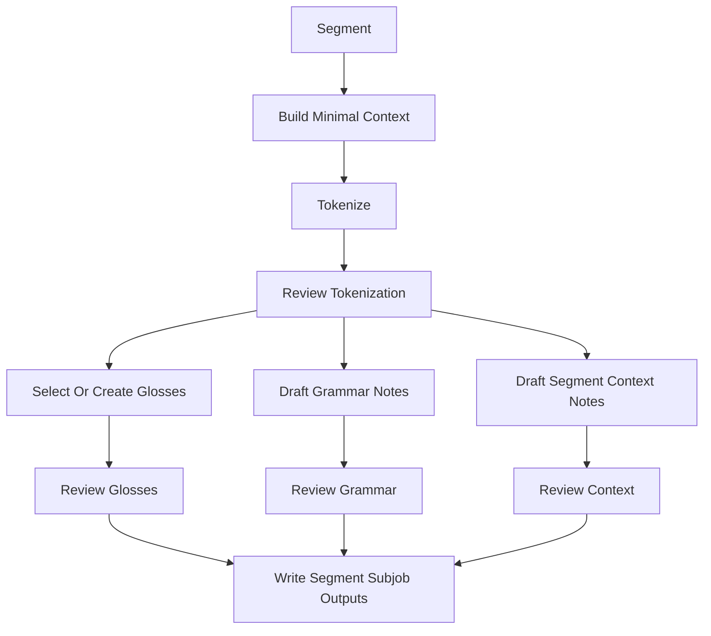
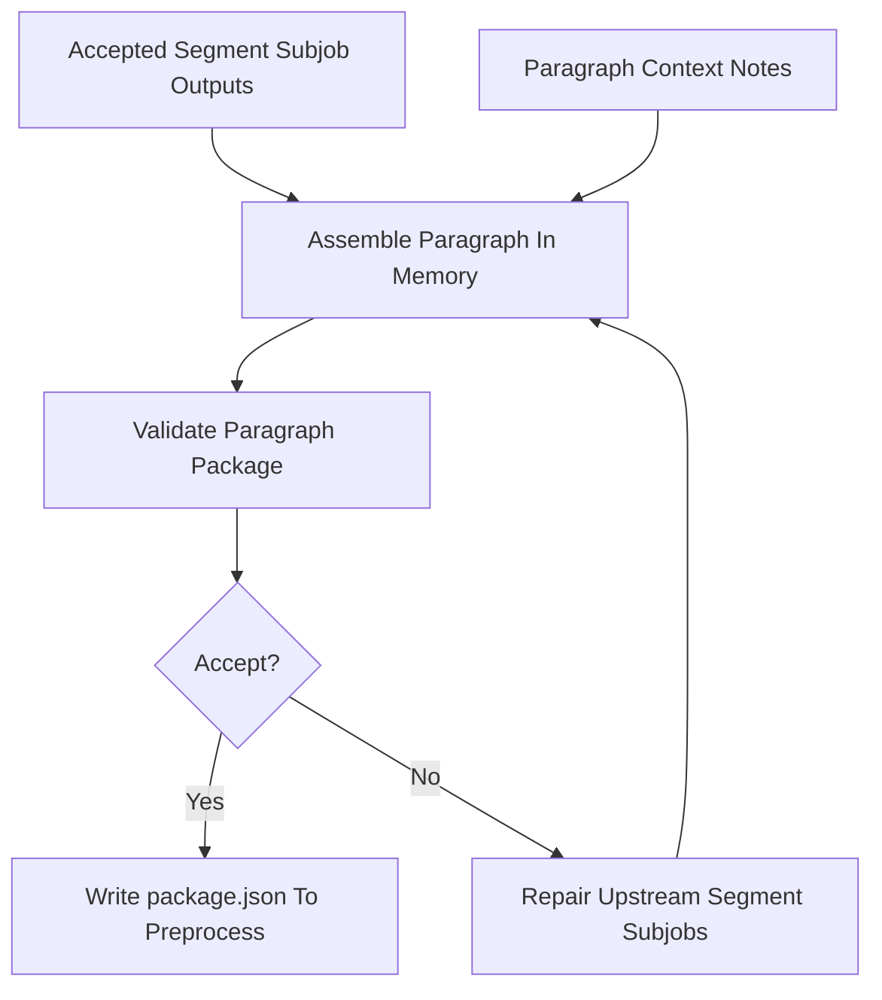

# Job Execution

## Segment Resumability Unit

The text segment is the main resumability unit for content generation. Within a segment, each focused content task should also be resumable so a failed grammar note pass does not require rerunning tokenization or gloss selection. Paragraph structure jobs still exist, but they should mostly prepare structure and shared context for segment subjobs.

- A paragraph can be delineated before all of its segments have been processed.
- A paragraph can contain one or more reader text segments.
- Each segment subjob can be retried without reprocessing sibling segments in the same paragraph.
- Completed segment subjob outputs can be written incrementally and assembled later.
- A paragraph container is complete only after its required segment subjobs have succeeded or been intentionally blocked.

Each paragraph structure job should receive bounded context:

- The current paragraph.
- A small window of neighboring paragraphs.
- The chapter title and any chapter-level summary already generated.
- Known entities and recurring terms from prior processed paragraphs.
- Retrieved source snippets for context-note grounding, when available.

Do not send an entire document to the model for ordinary paragraph or segment processing. For very large documents, create chapter summaries and rolling entity/glossary indexes that provide enough context for local decisions.

The paragraph structure job should produce:

- Reader segment boundaries.
- Optional paragraph-level context notes that apply across multiple segments.
- Focused segment subjob inputs.

Tokenization, gloss sense selection, new gloss drafting, grammar notes, and segment-local context notes should run as focused segment subjobs.

## Paragraph Structure Job Flow

## Focused Segment Subjob Flow

Each box after `Build Minimal Context` writes its own output artifact. Tokenization is the shared prerequisite; after tokenization review passes, gloss selection, grammar annotation, and segment-local context annotation can fan out in parallel. Accepted subjob outputs are combined during paragraph assembly.

## Paragraph Assembly Flow

Deterministic validation runs during `assemble-paragraph`. There is no LLM review at assembly time; segment subjob reviews are the editorial gate. `package-document` promotes validated packages to `content/`.

## Rate Limiting And Resumability

The preprocessing system should be job-based.

Each job should record:

- Stable document, chapter, paragraph, and segment IDs when the job is segment-scoped.
- Job kind, such as `tokenize-segment`, `gloss-segment`, `annotate-segment-grammar`, or `review-segment-gloss`.
- Input text hash.
- Prompt version.
- Model name and model settings.
- Structured output path.
- Error or review report when applicable.

Job metadata is embedded in output artifacts.

This lets the pipeline:

- Resume after interruption.
- Reprocess only changed segment subjobs when paragraph structure and earlier dependent outputs are unchanged.
- Respect provider rate limits.
- Cache successful LLM outputs.
- Compare outputs when prompts or models change.

LLM, parser, or validation failures should not leave final output artifacts in a partially complete state. A failed job may record a failure report and raw diagnostic data, but final output paths should be created only after the component output has been parsed, validated, and promoted atomically.

Rate-limit behavior:

- Process segment subjobs with a configurable concurrency limit.
- Process paragraph structure jobs separately, usually before focused segment subjobs in that paragraph.
- Retry transient provider failures with backoff.
- Stop or slow down when token-per-minute limits are reached.
- Keep each request bounded by the smallest useful unit: paragraph for segmentation/context framing; focused segment subjobs for tokenization, glosses, grammar, and context notes.
- Prefer many small resumable calls over a few huge calls.

## Repair And Blocking

On review rejection, the command writes the review report, exits non-zero, and leaves the component blocked or failed in status. The editor reruns the focused command manually after fixing inputs or deleting rejected artifacts.

After repeated failure, mark the smallest affected unit as blocked for later manual attention instead of silently accepting bad content. Prefer blocking an individual segment subjob over blocking a full segment or paragraph when the failure is local to tokenization, glossing, grammar, or context notes.
